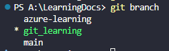
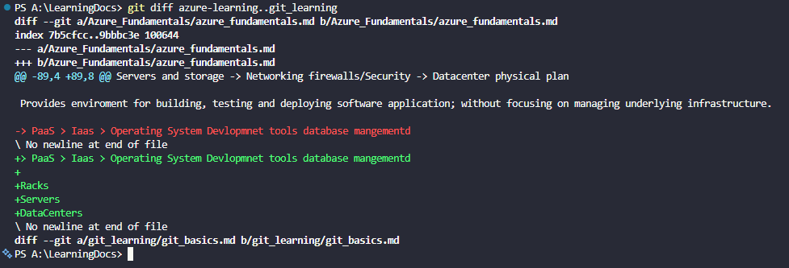
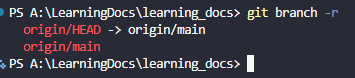

# GIT BASICS

## GIT History

- Linus Torvalds was the designer of linux and also created GIT
- Tovals wanted a version control system that was superfast AND Free, unlike existing tools.
- On April 3rd 2005 he got to work on his own VCS which would become Git. In a matter of days he had most basic functionality done.

## Configure Git

#### Your Identity

```
git config --global user.name "Akshar Chhowala"
git config --global user.email "your valid email"
```

This are used to set the username and email so that each commit has your name for other to know.

#### Your Editor

Now that your identity is set up, you need to configure the default text editor that will be used when Git needs you to type in a message. If not configured, Git uses you system's default editor.

If you want to use a different text editor, such as visual studio code, you can do the following setting.

```
git config --global core.editor "code --wait"
```

> <span style="color:yellow">INFO </span> In command we have use <span style="color:cyan">--wait</span> is so that the commit command will wait for you to save the message in the editor file.

#### Default Branch Name

By default Git will create a branch called master when you create a new repository with git init. From git version 2.28 ownwards, you can set a different name for the intial branch.

To set main as the default branch name do:

```
git config --global init.defaultBranch main
```

## Repository

- A Git Repo is a workspace which tracks and manages file within a folder.
- Anytime we want to use GIT with a project, app, etc we need to create a new repository.
- We can have as many repo on our machine as needed, all with separate histories and contents

## Git Init and Git Status

```
git init
```

Initialize the git in that folder this is done once per project

> **_*<span style="color:Red">Warning<span>*_** Before doing <span style="color:cyan">git init</span> always do <span style="color:cyan">git status</span>. Do not init a repo inside of a repo. Always use git status to check if the git is already present init or not

```
git status
```

use to get the status of the files and branches in the folder.

```
git log
```

This used to get the details of all the commit done on hte repo we have multiple optios to find exact which log we want we can filter the log based on user name branch etc...

```
git log --oneline
```

Gives the oneline description of all the commit

## Git Add And Git Commit

### Staging

- Before we can commit any changes we need to bring the files in staging mode/area we can do that using

```
git add <file-name>
```

- This command will bring the file into staging area.
- This is required because even if we are working on multiple file we don't want all to be commited under one commit.

#### Atomic Commit

- This means we need to commit the files logicaly.
- If we are working on a bug and a feature at the same time then only commit the files realted to bug together and another commit related to feature should be commited.

#### Short hand for Git Add

```
git add
```

This command will add all the modified files in staging area.

### Git Commit

This region need to be revisited and create the repo doc

## Working with Branches

### Introduction to Branch

Every commit has 3 components

1. The hash identifier of the commit which is qunique to it.
2. It also saves the parent hash set (to create a link tree).
3. Message accocited with the commit.

### Branches

They are an essential part of git!<br>
Think of them (branches) as alternative timeline for a project<br>
They enable us to create separate contexts where we can try new things, or even work on multiple ideas in parallel.<br>
If we make changes on one branch, they do not impact the other branches (unless we merge the changes).

#### Master/Main Branch

In git, we are always working on a branch. The default branch name is master/main (if we have changed the default branch name from master to main).<br>
It doesn't do anything special or have fancy powers. It's just like any other branch.

### HEAD

We'll often come across the term **Head** in Git.

**Head** is simply a pointer that refers to the current **location** in your repository. It points to a particular branch reference.

So far, **HEAD** always points to the latest commit you made on the master branch, but we can move around **HEAD** to different branches and will change the flow.

### Viewing Branches

```
git branch
```

This is used to view your existing branches. The default branch in every git repo is master. through we can configure this as discussed previously.

Look for the \* which indicated the branch you are currently on.



### Creating Branch

```
git branch <branch-name>
```

This is used to make a new branch based upon the current HEAD

This just creates the branch. It does not switch you to that branch (The Head stays the same).

### Switching Branch

Once you have created a new branch, use the below comman to switch to it.

```
git switch <branch-name>
```

#### Another way of switching branch

Historically, we used to switch branch using checkout command as shown below.
This still works

```
git checkout <branch-name>
```

The _checkout_ command does a million additional things, So the dicision was made to add a standalone _switch_ command which is much simpler.

You will see older tutorials/docs using checkout rather than switch. Both are valid and works

### Creating and Switching Branch

Use git switch with flag -c to create a new branch AND switch to it all in one go

```
git switch -c <branch-name>
```

> Remember -c as short for _"Create"_

### Switching branch with un-staged changes

1. What will happen when the changes are in conflict with other branches?
   - In this scenario git will throw error that there are confliting files and the changes will get overwrride if we will switch.
   - To do switch in this case is by commiting the change or by stashing them.
2. If we have add new file and that file fis not checked-in/commited in any branch (or the branch) you are switching to then that file will come with you to all the branch you switch to.

### Deleting and Renaming Branches

To delete a branch we need to use

```
git branch -d <branch-name>
```

This will delete a branch, The branch must be fully merged in its upstream branch, or in HEAD if no upstream was set with --track or --set --upstream-to.

```
git branch -D <branch-name>
```

> Shortcut for --delete or --force

### Rename/Move Branch

```
git branch -m <branch-name>
```

Move/Rename a branch and the corresponding reflog.

> **<span style="color:yellow">NOTE</span>** To delete a branch you need to go to any other branch but the branch you want to delete but for rename you need to goto the branch you want to rename

### Merging Branches

Branches makes it super easy to work within self contained contexts, but offen we want to incorporate changes from one branch into another!

We can do this using the <span style="color:cyan">git merge</span> command

Remember these two merging concepts:

1. We merge branches, not specific commits.
2. We Always merge to the current HEAD branch.

E.g : To merge the bugfix branch into master

```
git switch main
git merge bugfix
```

#### Fast Forward Merge

When a branch is created from a branch and a merge strategy that occurs when the target(the branch you are merging into) has no new commits since the source branch (the feature branch) was created.

### Resolving Conflicts

Whenever you encounter merge conflicts, follow these steps to resolve them:

1. Open up the file with merge conflicts.
2. Edit the files to remove. the conflicts. Decide which branch's content you want to keep in each conflict or keep the content from both.
3. Remove the conflict _makers_ in the document
4. Add your changes and then make a commit!

### Git Diff

```
git diff
```

We can use this command to view changes between commits, branches, files or working directory and more.

We often use <span style="color:cyan">git diff</span> alongside commands like <span style="color:cyan">git status</span> and <span style="color:cyan">git log</span> to get better picture of a repository and how it has changed over time.

```
git diff
```

compare staging area and working directory

Without additional options, <span style="color:cyan">git diff</span> lists all the changes in out working directory that are **NOT staged** for the next commit.

```
git diff head
```

list all the changes in the working tree since your last commit.

```
git diff --staged
git diff --cached
```

This will list the changes between the staging area and with our last commit

> Remeber it as _"Show me what will be included in my commit if I run commit right now"_

#### Diffing specific files

We can view the changes within a specfile by providing a file name

```
git diff head <file-name>
git diff --staged <file-name>
```

#### Comparing Branches

```
git diff <branch1>..<branch2>
```

This will list the changes between the tips of branch1 and branch2<br>
E.g:


We can use space instead of two dots to sperate the branch name

> NOTE Order of the branch name also matters

#### Comparing two commits

To compare two commits, provide git diff with the commit hashes of the commits in question.

```
git diff <commit1> <commit2>
```

## Git Stashing

Git provides an easy way of stashing these uncommited changes so that we can return to them later, without having to make unnecessary commits.

Git stash is super usefull command that helps you save changes that you are not yet ready to commit, you can stash changes and then come back to them later.

Running Git stash will take all uncommited changes (staged or un-staged) and stash them, reverting the changes in your working copy.

```
git stash
```

You can also use <span style="color:cyan">git stash save instead.

Use <span style="color:cyan">git stash pop</span> to remove the most recently stashed changed in your stash and re-apply them to your working copy.

```
git stash pop
```

#### Stash apply back

you can use <span style="color:cyan">git stash apply</span> to apply what ever is stashed away, without removing it from the stash. This can be usefull if you want to apply stashed changes to multiple branches.

```
git stash apply
```

##### Difference between stash pop and apply

| git stash pop                                     | git stash apply                                                                   |
| :------------------------------------------------ | :-------------------------------------------------------------------------------- |
| Pop the stash is removed from the stash registory | apply it is still exist in stash registory so can be applyed in multiple branches |

#### Stashing multiple times

You can add multiple stashes onto the stack of stashes. They will all be stashed in the order you added them.

#### Applying specific stash

git assums you want to apply the most recent stash when you run <span style="color:cyan">git stash apply</span> but you can also specify a particular stash like

```
git stsh apply stash@{2}
```

#### Droping Stashes

To delete a particular stash, you can use

```
git stash drop <stash-id>
```

## Git Checkout

The <span style="color:cyan">git checkout</span> command is like a _git swiss army knife_. Many developers think it is overloaded, Which is what lead to the addition of the <span style="color:cyan">git switch</span> and <span style="color:cyan">git restore</span> commands.

We can use checkout to create

- branches
- restore file
- undo history!

### Detached HEAD!

When we checkout a particular commit, HEAD points at that commit rather then at the branch point.

```
git checkout <commit-hash>
```

We can have couple of options:

1. Stay in detached HEAD to examin the commit of the old commit. Poke around, view the files, etc...
2. Leave and go back to wherever you were before re-attach HEAD
3. Create a new branch and switch to it. You can now make and save changes, since HEAD is no longer detached.

git checkout supports a slightly odd syntax for referecing pervious commits relative to a particular commit.

HEAD~1 refers to the commit before HEAD (parent)
HEAD~2 refers to 2 commits before HEAD (Grand parent)

This not essential, but to mention it because it's quite weird looking if you'r never seen it.

```
git checkout HEAD~1
```

### Discarding Changes

Suppose you've made some changes to a file but don't want to keep them. To revert the file back to whatever it looked like when you last commited you can use:

```
git checkout HEAD <file-name>
```

This will discard any changes in that file, reverling back to the HEAD

Here's **Another Option** to revert a file<br>
Rather than typing HEAD, you can substitute **--** followed by the file name you want to restore

```
git checkout -- <file-name>
```

## GIT Restore

```
git restore
```

This is a brand new git command that helps with undoing operations.

Recall that <span style="color:cyan">git checkout</span> does a million different things, which many git users find very confusing. <span style="color:cyan">git restore</span> was introduces alonside <span style="color:cyan">git switch</span> as alternative to some of the uses for checkout.

### Unmodifying file with restore

Suppose you have made some changes to a file since your last commit. You've saved the file but then realize you definetly do not want those changes anymore!<br>
To restore the file to the contents in the HEAD, use

```
git restore <file-name>
```

this restores using HEAD as the default source, but we can change that using the **_--source_** option.

```
git restore --source HEAD~1 app.js
```

### Unstageing files with restore

If you have accidently added a file to your staging area with git add and you don;t wish to include it in the next commit, you can use git restore to remove it from staging.

```
git restore --staged app.js
```

## GIT Reset

Suppose you've just made a couple of commit on the master branch, but you actually ment to make them on a seperate branch instead. To undo those commits, you can use

```
git reset <commit-hash>
```

this will rest the repo back to a specific commit.

> **<span style="color:red">DANGER</span>** The commits are gone.

### Reset --hard option

If you want to undo both the commit and the actual changes in your file, you can use the --hard option

```
git reset --hard <commit-hash>
```

for example:

```
git reset --hard HEAD~1
```

Will delete the last commit and associted changes.

## Git Revert

Yet another similar sounding confusing command that has to do with undoing changes.

Git reviert is similar to git reset in that they both **_undo_** changes, but they accomplish it in different ways.

Git reset actually moves the branch pointer backwards, eliminating commits.

Git revert instead creates a brand new commit which reverts/undos the changes from a commit. Because it results in a new commit, you will be prompted to enter a commit message.

```
git revert <commit-hash>
```

### Q Which one to use ?

**_Ans_** Both git reset and git revert helps to reverse changes but there is significant difference when it comes to collaboration.

If you want to reverse some commits that other people already have on their machines, you should use revert.

If you wnat to reverse commit that you haven't shared with others, use reset and no one will ever know!

---

---

<br>

# GitHub - The Basics

### Cloning

So far we've created our own git repository from scratch, but we want to get a local copy of an existing repository instead.

To do this, we can clone a remote hosted on GitHub or simillar websites. All we need is a URL that we can tell git to clone for use.

```
git clone <http://repo-url-you-need-to-clone>
```

this will clone the repo in your folder and also it will create a folder structure and default branch which will be same as that in github (if master then master or main).

if you want to give your local folder a different name then do the following

```
git clone <http://repo-url-you-need-to-clone> <your-folder-name>
```

### Remote

Before we can push anything. upto GitHub we need to tell git about our remote repository on github. We need to setup a **_destination_** to push upto.<br>
In git, we refer to these **_destination_** as **_remote_**.<br>
Each remote is simply a URL where a hosted repository lives.

when we do cloning by default git creates a remote name origin for us and tracks the main/master branch for us.

> NOTE While cloning all other branches and there info is also downloded but we need to add tracker for each branch will learn that later.

### Viewing Remote

To view any existing remote for your repository, we can run following commands

```
git remote
git remote -v
```

here option -v stands for the verbose, for more information.

This just display list of remotes. If you haven't added you wont see anything.

### Adding a remote

A remote is really two things

1. URL
2. Lable

To add a new remote, we need to provide both to git.

```
git remote add <remote-name> <https://<path-for-the-github-repo>>
```

## Pushing code to GitHub

Now that we have a remote setup, let's push some work upto GitHub! Todo this, we need to use

```
git push
```

we need to specify the remote we want to push upto and the specific local branch we want to push upto that remote.

```
git push <remote> <branch>
```

for the first time if we have not set the tracker [tracker is the relation of local branch with remote/branch]<br>We need to use comman with option -u It links your current local branch to a specific branch on the remote repository (like GitHub or GitLab). You only need to use it the very first time you push a new branch.

```
git push -u origin main
```

### Push in detail

While we often want to push a local branch upto a remote branch of the same name, we don't have to!

To push our local branch to a remote branch with a different name we could do

```
git push <remote> <local-branch-name>:<remote-branch-name>
git push origin pancake:waffle
```

### The -u option in detail

The **-u** option allows us to set the upstream of the branch we're pushing. You can think of this as a link connecting our local branch to a branch on GitHub

Running **_git push -u origin master_** sets the upstream of the local master branch so that it taracks the master branch on the origin repository

```
git push -u origin main
```

### Remote tracking branches

At the time you last communicted with this remote repository, here is where x branch was pointing.

They follow this pattern \<remote>/\<branch>
below are some examples of the remote branches

- origin/master references the state of the master branch on the remote repo named master
- upstream/logoRedesign reference the state of the logoRedesign branch on the remote named upstream.

### Viewing Remote Branches

Run git branch with the option -r to view the remote branches our local repository knows about

```
git branch -r
```

out put of this will look like below



### Create branch from remote

```
git switch <remote-branch-name>
```

use this to create a new local branch from the remote branch with the same name.

```
git switch puppies
```

this comman makes me a local puppies branch and set it up to track the remote branch origin/puppies

#### Create branch from remote using checkout

Before switch we used to create new branch from checkout as shown below

```
git checkout --track <remote>/<branch-name>
```

## Fetching in Git

Fetching allows us to download changes from a remote repository, But those changes will not be automatically integrated into our working files.

It lets you see what other's have been working on without having to merge those changes into our local repo.

Think of it as _"please go and get the latest information from GitHub, but don't screw up my working directory"_.

#### Git Fetch

```
git fetch <remote>
```

This command fetches braches and history from a specific remote repository. It only updates remote tracking branches.

**_git fetch origin_** would fetch all changes from the origin remote repository.

## Pulling

```
git pull
```

This is another command we can use to retrieve changes from a remote repository unlike fetch, pull actually updates our HEAD branch with whatever changes are retrieved from the remote.

think of it as **_"Go and download data from GitHub and immediately update my local repo with those changes"_**

**_git pull = git fetch + git merge_**

| git fetch                                                                      | git pull                                                                         |
| :----------------------------------------------------------------------------- | :------------------------------------------------------------------------------- |
| Update the remote tracking branch with the latest changes from the remote repo | Update my current branch with whatever changes are on the remote tracking branch |

### Git Pull in detail

To pull, we specify the particular remote and branch we want to pull using

```
git pull <remote> <branch>
```

> Just like with git merge, it matters WHERE we run this command from.

Whatever branch we run it from is where the changes will be merged to.

Git pull origin master would fetch the lates information from the origin's master branch and merge these changes into our current branch.

### Easier Syntax!

If we run **_git pull_** without specifying any particular remote or branch to pull from, git assumes the following.

- Remote will default to origin.
- Branch will default to whatever tracking configuration is configured for your current branch.

> **NOTE** This behavior can be configured and tracking connection can be changed manually. Most of us don't mess with that stuff!

| git fetch                                            | git pull                                                              |
| :--------------------------------------------------- | :-------------------------------------------------------------------- |
| Gets changes from remote branches                    | Gets changes from remote branches                                     |
| Updates the remote-tracking branch with new changes  | Updates the current branch with the new changes merging them in local |
| Does not merge changes onto your current HEAD branch | Can result in merge conflicts                                         |
| Safe to do anytime                                   | Not recommended if you have uncommited changes                        |
